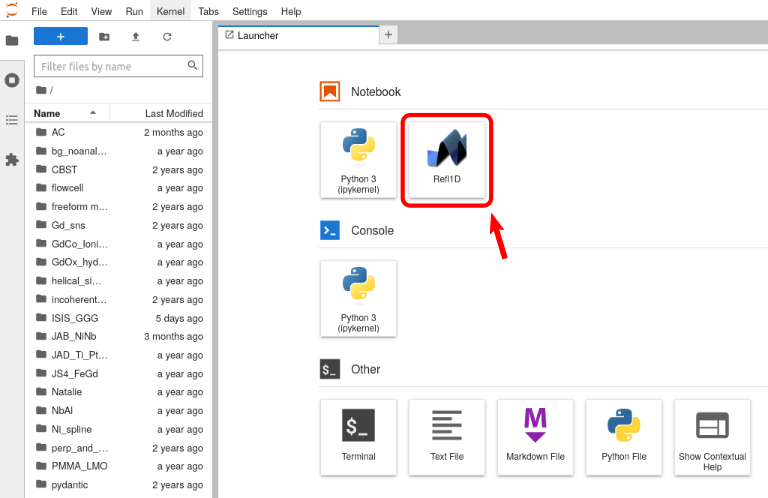

# nb_serverproxy_refl1d
Jupyter server proxy for refl1d webview

> Based on the original https://github.com/innovationOUtside/nb_serverproxy_openrefine

Jupyter-server-proxy config for running Refl1D.

## Requires
Install as:

```bash
pip install git+https://github.com/bmaranville/nb_serverproxy_refl1d.git
```

Install a version of refl1d that supports webview:
```bash
pip install git+https://github.com/bumps/bumps.git@dataclass_overlay
pip install git+https://github.com/reflectometry/refl1d.git@webview
```

From the JupyterLab launcher:



The Refl1D client can be found on the `refl1d` path (the port number is allocated dynamically).

The host refl1d will use is `127.0.0.1`.
